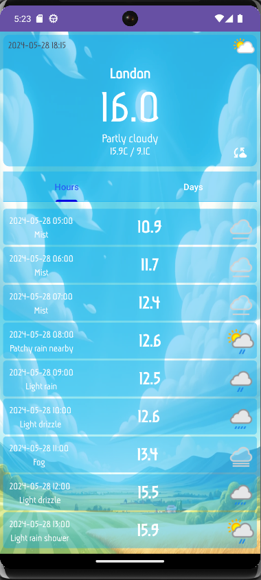

#**Weather Forecast**

Weather Forecast is a test project for fetching and displaying weather forecasts. It is developed using the MVVM architectural pattern and the Volley library for network requests. 
The project aims to familiarize with the Volley library and compare its pros and cons against Retrofit.

#**Technologies Used**
- MVVM (Model-View-ViewModel): An architectural pattern that separates the development of the graphical user interface from the business logic or back-end logic.
- Volley: An HTTP library used for network requests. This library is used to understand its working and compare it with Retrofit.
#*Features*
- Fetches current weather forecast for a specified location.
- Displays temperature, humidity, wind speed, and other meteorological data.
- Simple and intuitive user interface.

#**Usage**
- Launch the app on your device.
- View the current weather details including temperature, humidity, and wind speed.

#**Comparison: Volley vs Retrofit**

*Pros of Volley:*
- Easy to use and setup.
- Manages network requests and responses efficiently.
- Built-in request queuing and prioritization.

*Cons of Volley:*
- Less flexible for complex APIs.
- Manual parsing of JSON responses is required.
- No built-in support for converting JSON to Java/Kotlin objects.

*Pros of Retrofit:*
- Easy to parse JSON responses into Java/Kotlin objects using converters.
- Supports various data formats and converters (e.g., Gson, Moshi).
- Easy to handle errors and retry mechanisms.

*Cons of Retrofit:*
- Slightly steeper learning curve compared to Volley.
- Requires additional dependencies for converters.

#**Screenshots**
### Home Screen
